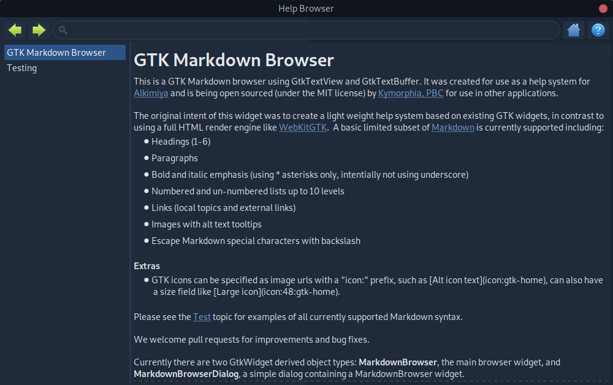
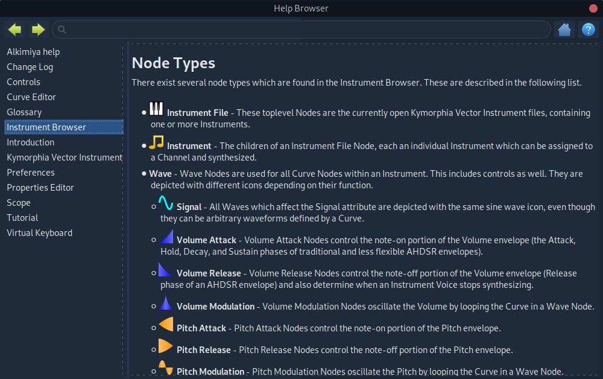

# GTK Markdown Browser
This is a GTK Markdown browser using GtkTextView and GtkTextBuffer. It was created for use as a help system for [Alkimiya](https://www.kymorphia.com/products/alkimiya/) and is being open sourced (under the MIT license) by [Kymorphia, PBC](https://www.kymorphia.com) for use in other applications.

The original intent of this widget was to create a light weight help system based on existing GTK widgets, in contrast to using a full HTML render engine like [WebKitGTK](https://webkitgtk.org/).  A basic limited subset of [Markdown](https://www.markdownguide.org/basic-syntax) is currently supported including:
* Headings (1-6)
* Paragraphs
* Bold and italic emphasis (using \* asterisks only, intentially not using underscore)
* Numbered and un-numbered lists up to 10 levels
* Links (local topics and external links)
* Images with alt text tooltips
* Escape Markdown special characters with backslash

**Extras**
* GTK icons can be specified as image urls with a "icon:" prefix, such as \[Alt icon text](icon:gtk-home), can also have a size field like \[Large icon](icon:48:gtk-home).

## Screenshots

Please see the [Test](test) topic for examples of all currently supported Markdown syntax.

We welcome pull requests for improvements and bug fixes.

Currently there are two GtkWidget derived object types: **MarkdownBrowser**, the main browser widget, and **MarkdownBrowserDialog**, a simple dialog containing a MarkdownBrowser widget.

## MarkdownBrowserDialog
A GtkDialog with a MarkdownBrowser widget in it's content area.

### functions
* **markdown_browser_dialog_new()** - Create new browser dialog widget.
* **markdown_browser_dialog_get_browser()** - Get the MarkdownBrowser widget contained in the dialog.

## MarkdownBrowser
This widget is derived from GtkBox and is separate from MarkdownBrowserDialog to make it easily embeddable in other GTK containers.

A directory of Markdown topics can be added alphabetically with **markdown_browser_add_files()**. By default topics are contained in a single Markdown file, with the file name without the .md or .markdown extension used as the topic name ID, and the first Heading1 being used for the title. However topics can also be added with **markdown_browser_add_topic()** to define the name, title, and content or to define custom topic sort order.

### Properties
* **ui-file** - External UI interface file to use, default is to use compiled-in interface data from MarkdownBrowser.ui.
* **images-path** - Path to base directory for images referenced by markdown content.
* **topic-index** - Current topic index or -1 if no topic selected.
* **history-position** - Current topic history position to store next visit to (can be 1 index after the current history array)
* **history-size** - Current history array size
* **history-max** - Maximum history size (older entries are removed)
* **bullet-chars** - Bullet characters, one for each nested list level, last character is used for remaining levels (default is "●○■")
* **home-topic** - Home topic name (default is "README")

### functions
Please consult the MarkdownBrowser.h header file for full details.

* **markdown_browser_new()** - Create a new MarkdownBrowser widget
* **markdown_browser_navigate()** - Navigate to a new topic or position in topic visit history.
* **markdown_browser_navigate_to_topic_by_name()** - Navigate to a topic by name.
* **markdown_browser_get_topic_by_name()** - Get topic index by name.
* **markdown_browser_get_topics()** - Get array of browser topic information.
* **markdown_browser_get_history()** - Get array of browser visit history information.
* **markdown_browser_add_topic()** - Add a single Markdown topic to a browser widget.
* **markdown_browser_add_files()** - Add Markdown files from a directory path.

